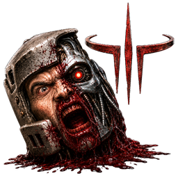
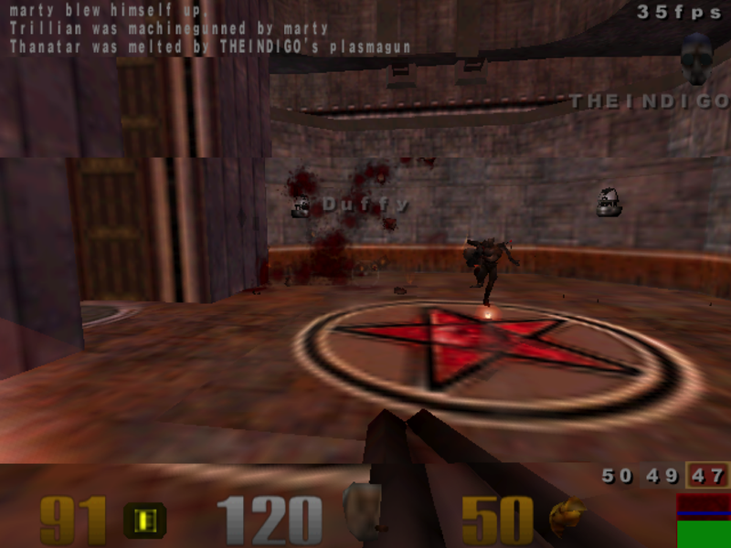
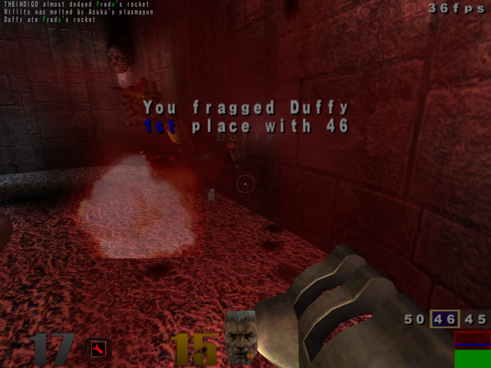
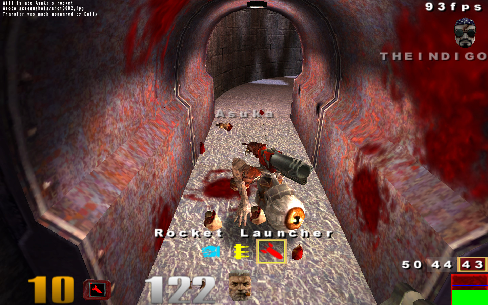
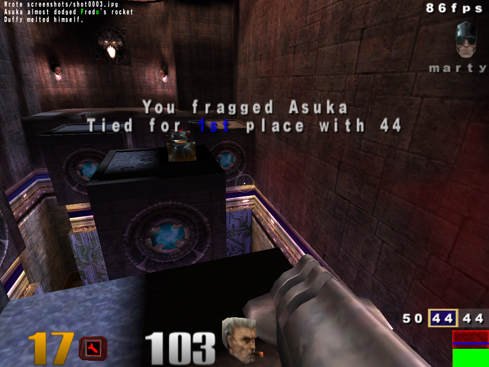

# ioquake3 — old-Mac port

**Quake III Arena running again on vintage Macs** — Panther on a G3, Tiger on a
G4, Lion on Intel — all from a single fat binary.

A port of [ioquake3](https://ioquake3.org/) built as one fat PowerPC + Intel
binary, tested on a range of old Macs. One Mach-O bundle (`ppc750` + `ppc7400` +
`x86_64`) drops onto every machine and `dyld` picks the right slice at runtime —
down to a 449 MHz iMac G3 with a 16 MB Rage 128, right at the minimum spec when
Q3 shipped in 1999.

> **About this project.** A personal project — I love Quake and I collect and
> tinker with old Macs. My part is the setup and testing: the build, deploy and
> benchmark scripts, and the per-machine settings. The engine and config changes
> were made mostly **with AI (Claude), which I directed and checked against real
> benchmarks on the machines** — most of the work here is tooling and config, not
> changes to the engine itself.

| G3 · Panther · Rage 128 | G4 · Tiger · Radeon 9000 |
|:---:|:---:|
|  |  |

| G5 · Leopard · Radeon 9600 | Intel mini · Lion · GMA 950 |
|:---:|:---:|
|  |  |

## Tested machines

| Machine | CPU | GPU | macOS | Slice |
|---|---|---|---|---|
| yosemite | G3 449 MHz | Rage 128 16 MB | Panther 10.3.9 | ppc750 |
| sawtooth | G4 500 MHz | GeForce2 MX 32 MB | Tiger 10.4.11 | ppc7400 |
| quicksilver | G4 733 MHz | Radeon 9000 Pro 64 MB | Tiger 10.4.11 | ppc7400 |
| mini-g4 | G4 1.25 GHz | Radeon 9200 32 MB | Tiger 10.4.11 | ppc7400 |
| imac-g5 | G5 2.0 GHz | Radeon 9600 128 MB | Leopard 10.5.8 | ppc7400 |
| mini-intel | Core 2 Duo 2.33 GHz | GMA 950 | Lion 10.7.5 | x86_64 |
| imac-2019 | i5-9600K | Radeon Pro 580X 8 GB | Sequoia 15.7 | x86_64 |

## Framerate

Each machine runs a per-machine config at its native panel resolution. The
`four` timedemo runs from ~22 fps on the 449 MHz G3 (800×600) up to ~60 on the
G5 (1440×900); tuning is ongoing, and live numbers are in
[`benchmarks/results.csv`](benchmarks/results.csv).

## Features

- **One fat binary for every machine** — `ppc750` (G3), `ppc7400` (G4 AltiVec)
  and `x86_64` (Intel) slices in a single Mach-O.
- Runs on **Mac OS X 10.3.9 → 10.7**, and modern macOS via the Intel slice.
- **SDL 1.2** — the last SDL line that supports Panther and Tiger — with a
  monolithic OpenGL1 renderer.
- **Per-machine auto-config** — reads `hw.model` at boot and applies a tuned
  `autoexec` baked into the `.app` (resolution, FSAA, anisotropic + trilinear
  filtering, texture/colour depth).
- **Native game modules** — `cgame`/`qagame`/`ui` ship as fat native dylibs
  built from stock source, replacing the bundled bytecode; a small measured win,
  with automatic fallback to the bytecode.
- Self-contained **`ioquake3.app`** with a custom icon that renders correctly
  from Panther's Finder to modern macOS.
- Optional **Apple Watch "tactical computer" companion** (`watchlink`) — off by
  default; enable with `seta watch_host "auto"`.

## Get the latest release

Download the latest disk image from
[**Releases**](https://github.com/matthewdeaves/old-mac-quake3/releases/latest)
(`ioquake3-OldMac-<version>.dmg`) — one image runs on Panther, Tiger, Lion and
modern macOS.

Game data (`baseq3` `.pk3` files) is **not** included — you need your own copy
of Quake III Arena. Drop `ioquake3.app` and your `baseq3/` folder next to each
other and launch. On modern macOS, clear Gatekeeper with
`xattr -dr com.apple.quarantine ioquake3.app` (not needed on Panther/Tiger/Lion).

## Sister projects

Same machines, same tooling, older id engines:
[**old-mac-quakespasm**](https://github.com/matthewdeaves/old-mac-quakespasm)
(Quake) and [**old-mac-quake2**](https://github.com/matthewdeaves/old-mac-quake2)
(Quake II).

## Credits & licence

Built on [ioquake3](https://github.com/ioquake/ioq3) and id Software's Quake III
Arena engine. Released under the **GPLv2** (see [`COPYING.txt`](COPYING.txt)).
This port adds the old-Mac build/deploy tooling and the SDL 1.2 / Panther fixes;
the upstream engine readme is preserved in [`README`](README).
