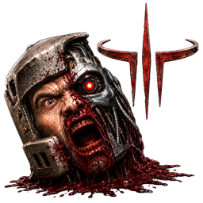
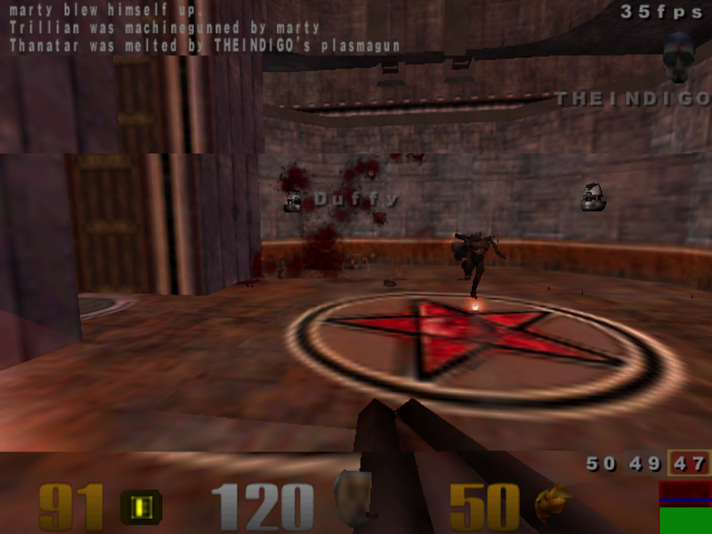
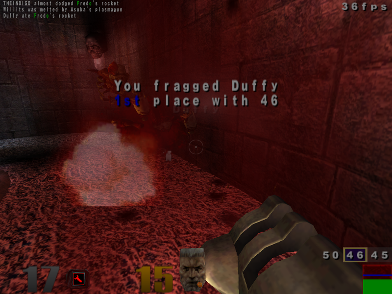
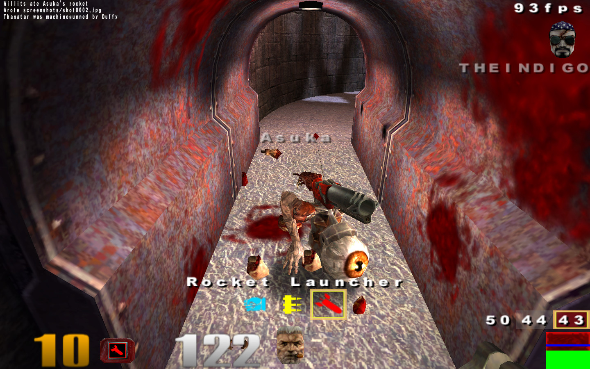
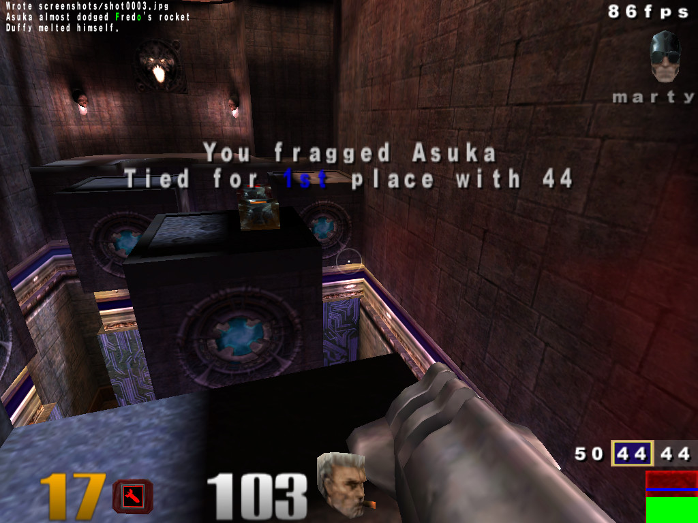

<div align="center">



# ioquake3: old-Mac port

**Quake III Arena running again on vintage Macs**, Panther on a G3, Tiger on a
G4, Leopard on a G5, Lion on Intel, and natively on Apple Silicon, all from a
single fat binary.

</div>

A port of [ioquake3](https://ioquake3.org/) built as one fat binary spanning
**twenty-six years of Macs**, tested on a range of real hardware. One Mach-O
bundle carries **five slices** (`ppc750` + `ppc7400` + `i386` + `x86_64` +
`arm64`) and `dyld` picks the right one at runtime, from a 449 MHz iMac G3 with
a 16 MB Rage 128, right at the minimum spec when Q3 shipped in 1999, up to an
M-series Mac where it runs native rather than under Rosetta.

> **About this project.** A personal project, I love Quake and I collect and
> tinker with old Macs. My part is the setup and testing: the build, deploy and
> benchmark scripts, and the per-machine settings. The engine and config changes
> were made mostly **with AI (Claude), which I directed and checked against real
> benchmarks on the machines**, most of the work here is tooling and config, not
> changes to the engine itself.

<div align="center">

| G3 · Panther · Rage 128 | G4 · Tiger · Radeon 9000 |
|:---:|:---:|
|  |  |

| G5 · Leopard · Radeon 9600 | Intel mini · Lion · GMA 950 |
|:---:|:---:|
|  |  |

</div>

## Tested machines

| Machine | CPU | GPU | macOS | Slice |
|---|---|---|---|---|
| yosemite | G3 449 MHz | Rage 128 16 MB | Panther 10.3.9 | ppc750 |
| sawtooth | G4 500 MHz | GeForce2 MX 32 MB | Tiger 10.4.11 | ppc7400 |
| quicksilver | G4 733 MHz | Radeon 9000 Pro 64 MB | Tiger 10.4.11 | ppc7400 |
| mini-g4 | G4 1.25 GHz | Radeon 9200 32 MB | Tiger 10.4.11 | ppc7400 |
| imac-g5 | G5 2.0 GHz | Radeon 9600 128 MB | Leopard 10.5.8 | ppc7400 |
| mini-intel | Core 2 Duo 2.33 GHz | GMA 950 | Lion 10.7.5 | x86_64 |
| imac-2019 | i5-9600K | Radeon Pro 580X 8 GB | Sequoia 15.7 | x86_64 |
| mini-sl | Core 2 Duo 2.26 GHz | GeForce 9400 | Snow Leopard 10.6.8 | x86_64 |
| quad-leopard | G5 quad 2.5 GHz | - | Leopard 10.5.8 | ppc7400 |
| (orchestration Mac) | Apple M5 | - | macOS 26 | arm64 |

### Which OS each CPU needs

Five slices cover six CPU families, the G5 running the same `ppc7400` slice as the G4s.
Each is built against the **oldest** OS its CPU family can run, not the OS the machines
here happen to run:

| CPU | Slice | OS needed | Tested on |
|---|---|---|---|
| G3 (750) | `ppc750` | 10.3.9 Panther or later | 10.3.9 |
| G4 (7400 / 7450 / 7447A) | `ppc7400` | 10.3.9 Panther or later | 10.4.11 |
| G5 (970) | `ppc7400` | 10.3.9 Panther or later | 10.5.8 |
| Intel, 32-bit only | `i386` | 10.4 Tiger through 10.6.8 | **not run on hardware** |
| Intel, 64-bit | `x86_64` | 10.6 Snow Leopard or later | 10.7.5 and 15.7 |
| Apple Silicon | `arm64` | 11.0 Big Sur or later | macOS 26 |

The `i386` slice exists for the 2006 Core Solo and Core Duo machines (Mac mini 1,1,
iMac 4,1, MacBook 1,1, MacBook Pro 1,1), the only Intel Macs with no 64-bit mode.
Without it those machines are handed nothing at all and the app does not launch. There
is no such machine here, so its settings come from documented capability rather than
measurement, and the config says so.

The `arm64` slice is the only one that does not link a real SDL 1.2, because none
exists for that architecture. It links `sdl12-compat` over an SDL 2.32.4 that this
project builds and ships itself, so the stack is two layers we control end to end
rather than whatever a package manager would resolve to. PowerPC and Intel are
untouched by that and keep the genuine SDL 1.2. See `docs/adr/0017`.

`dyld` picks a slice by **CPU subtype alone**, the OS plays no part. A Mac running an
OS older than its slice was built for gets that slice anyway rather than falling back to
a lower one, and won't launch. That is why the `ppc7400` slice is built at 10.3 even
though no G4 or G5 here runs Panther: a G4 on Panther is a normal machine to own, and
building the slice any higher would leave it dead with no way to force a different one.
Doing it costs nothing on Tiger, see the before/after numbers below.

The right-hand column is the honest part: **a G4 on Panther, and a G5 on Panther or
Tiger, should work but have not been run on hardware**, there's no such machine here.
Same for an Intel Mac on Snow Leopard.

32-bit-only Intel Macs (Core Duo / Core Solo, 2006) **do** now have a slice. There is
still no such machine here to run it on, so it is build-correct rather than tested, and
its config says so in its own comments.

### What lowering the floor cost

Nothing measurable. Same source, same commit, `four` timedemo, three runs, median of
2 & 3, the old `ppc7400` slice (10.4u SDK) against the new one (10.3.9 SDK):

| Machine | Before | After |
|---|---:|---:|
| Quicksilver (G4 / Radeon 9000) 1680×1050 | 41.65 | 41.40 |
| Mac mini G4 (Radeon 9200) 1680×1050 | 27.55–30.00 † | 27.60 |
| Mac mini Intel (Lion / GMA 950) 1920×1080 | 41.20 | 42.00 |

† The mini G4's "before" is a range, not a figure: four passes at the same commit
recorded 27.55, 27.90, 27.90 and 30.00. The new result sits inside that spread, so
it's a weaker comparison than the other two rows, worth stating rather than quoting
whichever end flattered the result.

Run-to-run spread within a single pass is about ±0.3 fps, so quicksilver and the Intel
mini are ties. The G4 slice also disassembles to **exactly the same 165 AltiVec
instructions** before and after: AltiVec codegen follows `-arch`/`-mcpu`, not the SDK.

These are *bench-harness* numbers, the per-machine auto-config is switched off
(`+set com_archAutoexec 0`) so the engine runs defaults plus the resolution, which is
what makes them comparable across commits. They are **not** the framerates you get
playing, which are below.

## Framerate

Each machine runs a per-machine config at its native panel resolution. The
`four` timedemo runs from ~22 fps on the 449 MHz G3 (800×600) up to ~60 on the
G5 (1440×900); tuning is ongoing, and live numbers are in
[`benchmarks/results.csv`](benchmarks/results.csv).

**The G3 got a lot faster in v0.6.0: 21.6 → 33.3 fps**, measured on the production
path on 10.3.9, and its mirrors work again.

The machine was profiled rather than guessed at. It spends **93% of the frame in the
renderer backend** (67 ms of 72), and the resolution ladder is almost perfectly inverse
with pixel count (20.8 / 13.8 / 4.4 fps at 640×480 / 800×600 / 1024×768), so it is
bound by texels rasterised and nothing else. Texture size, geometry detail, LOD bias,
mipmap mode, vertex submission path and compiled vertex arrays were all measured and are
all inside noise. `r_ext_compressed_textures` had never done anything at all: the Rage
128 driver reports no S3TC.

Two things actually paid, and both are in v0.6.0:

- **Mirrors were black because of this port's own `r_fastsky 2`.** That setting dodged
  the gate that disables portals, but the same style of truthy test clears the colour
  buffer to black for the portal's view too, so the reflection was drawn and then wiped.
  Real sky is also marginally *faster* here, so the cheap sky had cost every reflection
  in the game for nothing.
- **Flares cost 45% of the frame**, and it is not fill: shrinking them changed nothing.
  Each flare does a one-pixel `glReadPixels` of the depth buffer, and the first such
  sync in a frame drains the command queue and destroys CPU/GPU overlap for that whole
  frame. `r_flareTestInterval` re-tests occlusion every Nth frame instead of every
  frame, which keeps the flares and recovers most of the cost.

Panther and Tiger still have not been compared on this hardware; that remains open.

## Features

- **One fat binary for every machine**, `ppc750` (G3), `ppc7400` (G4/G5 AltiVec),
  `i386` (2006 Core Solo/Duo), `x86_64` (Intel) and `arm64` (Apple Silicon) slices in
  a single Mach-O.
- Runs on **Mac OS X 10.3.9 Panther through current macOS**, natively on every one,
  including Apple Silicon rather than under Rosetta.
- **SDL 1.2**, the last SDL line that supports Panther and Tiger, with a
  monolithic OpenGL1 renderer.
- **Per-machine auto-config**, reads `hw.model` at boot and applies a tuned
  `autoexec` baked into the `.app` (resolution, FSAA, anisotropic + trilinear
  filtering, texture/colour depth).
- **Native game modules**, `cgame`/`qagame`/`ui` ship as fat native dylibs
  built from stock source, replacing the bundled bytecode; a small measured win,
  with automatic fallback to the bytecode.
- Self-contained **`ioquake3.app`** with a custom icon that renders correctly
  from Panther's Finder to modern macOS.
- Optional **Apple Watch "tactical computer" companion** (`watchlink`), off by
  default; enable with `seta watch_host "auto"`.

## Get the latest release

Download the latest disk image from
[**Releases**](https://github.com/matthewdeaves/old-mac-quake3/releases/latest)
(`ioquake3-OldMac-<version>.dmg`), one image runs on Panther, Tiger, Lion and
modern macOS.

Game data (`baseq3` `.pk3` files) is **not** included, you need your own copy
of Quake III Arena. Drop `ioquake3.app` and your `baseq3/` folder next to each
other and launch. On modern macOS, clear Gatekeeper with
`xattr -dr com.apple.quarantine ioquake3.app` (not needed on Panther/Tiger/Lion).

## Sister projects

Same machines, same tooling, older id engines:
[**old-mac-quakespasm**](https://github.com/matthewdeaves/old-mac-quakespasm)
(Quake) and [**old-mac-quake2**](https://github.com/matthewdeaves/old-mac-quake2)
(Quake II).

### Where to put it on Apple Silicon and modern macOS

Put the game folder in **`/Applications`**, not on the Desktop.

macOS asks an app for permission before it may read files in Desktop, Documents
or Downloads, and it asks **every launch** for an app it cannot identify
consistently. A game that lives in `/Applications` is outside those protected
locations, so it never triggers the prompt and can read its own game data
without being interrupted.

So: drag the whole folder (the `.app` **and** the game data beside it) into
`/Applications`, keeping them together. On first run, clear Gatekeeper with:

```sh
xattr -dr com.apple.quarantine /Applications/<folder>
```

PowerPC and Intel Macs running 10.3 through 10.7 have none of this and can keep
the folder wherever you like.

## Credits & licence

Built on [ioquake3](https://github.com/ioquake/ioq3) and id Software's Quake III
Arena engine. Released under the **GPLv2** (see [`COPYING.txt`](COPYING.txt)).
This port adds the old-Mac build/deploy tooling and the SDL 1.2 / Panther fixes;
the upstream engine readme is preserved in [`README`](README).
